# 🩸 Hemodoar 💉

> Sistema de Gerenciamento de Doação de Sangue

| O **Hemodoar** é uma aplicação web projetada para facilitar o gerenciamento de doações de sangue, conectando doadores, hemocentros e pacientes em uma plataforma centralizada. O sistema visa aumentar a disponibilidade de sangue nos bancos hemoterápicos, reduzir o desperdício por vencimento de estoques e agilizar o processo de triagem e agendamento de doações. | 🩸 |
| --- | --- |

---

## 🚧 Status do Projeto

---

## 📚 Índice

- [Sobre o Projeto](#-sobre-o-projeto)
- [Tecnologias Utilizadas](#-tecnologias-utilizadas)
- [Arquitetura](#-arquitetura)
- [Diagramas](#-diagramas)
- [Licença](#-licença)

---

## 📝 Sobre o Projeto

O **Hemodoar** nasceu da necessidade de modernizar e centralizar a gestão de doações de sangue no Brasil, um país que ainda enfrenta déficits recorrentes em estoques hemoterápicos.

A aplicação foi desenvolvida como **Trabalho Final da disciplina de Laboratório de Desenvolvimento de Software** do curso de Engenharia de Software da PUC Minas, sob orientação do **Prof. Dr. João Paulo Aramuni**.

**Problema que resolve:**
- Hemocentros carecem de sistemas integrados para controle de estoque, agendamento e triagem.
- Doadores não têm visibilidade sobre quais tipos sanguíneos estão em falta.
- Hospitais não conseguem localizar rapidamente bancos com o tipo sanguíneo necessário para urgências.

**Valor entregue:**
- Doadores podem se cadastrar, agendar doações e receber notificações quando seu tipo sanguíneo está em baixa.
- Hemocentros gerenciam estoque em tempo real, triagem e relatórios de demanda.
- Administradores têm visibilidade total do sistema e podem emitir alertas de escassez.

**Contexto:** Projeto acadêmico com foco em arquitetura e modelagem — não requer implementação de código, mas sim diagramação completa com PlantUML e documentação técnica detalhada.

---

## 🛠 Tecnologias Utilizadas

### 💻 Front-end

- **Biblioteca:** React v19.1.0
- **Linguagem:** TypeScript / JavaScript ES6+
- **Estilização:** Tailwind CSS v3.4
- **Gerenciamento de Estado:** Context API + React Query
- **Build Tool:** Vite v5.2
- **Roteamento:** React Router DOM v6

### 🖥️ Back-end

- **Linguagem/Runtime:** Java 17 (JDK)
- **Framework:** Spring Boot 3.3.5
- **Banco de Dados:** PostgreSQL 16
- **ORM:** Hibernate / Spring Data JPA
- **Autenticação:** Spring Security + JWT (JSON Web Token)
- **Documentação de API:** SpringDoc OpenAPI (Swagger UI)
- **Build:** Maven 3.9.x

### ⚙️ Infraestrutura & DevOps

- **Containerização:** Docker + Docker Compose
- **Cloud (Deploy):** Vercel (front-end) + Railway (back-end + banco)
- **CI/CD:** GitHub Actions
- **Modelagem:** PlantUML

---

## 🏗 Arquitetura

O sistema adota a **arquitetura em camadas** (Layered Architecture) no back-end, seguindo o padrão **MVC** com separação clara de responsabilidades, e uma SPA (Single Page Application) no front-end.

**Principais camadas:**
- **Controller:** Expõe os endpoints REST, recebe e valida as requisições HTTP.
- **Service:** Contém toda a lógica e regras de negócio do domínio.
- **Repository:** Abstrai o acesso ao banco de dados via Spring Data JPA.
- **Model/Entity:** Representa as entidades persistentes mapeadas para tabelas PostgreSQL.
- **DTO:** Objetos de transferência de dados que desacoplam a camada de apresentação da camada de domínio.
- **Security:** Configuração do Spring Security, filtros JWT e controle de acesso por perfil (DOADOR, HEMOCENTRO, ADMIN).

**Fluxo de dados principal:**
`React (Axios) → Controller REST → Service → Repository → PostgreSQL`

## 📊 Diagramas

Os diagramas completos estão disponíveis na pasta [`Diagramas`](./Diagramas) e seus respectivos códigos-fonte PlantUML na pasta [`Codigos PlantUML`](./Codigos%20PlantUML).

> 📌 Clique na imagem para visualizá-la em tamanho completo ou utilize o link **Código PlantUML** para acessar a implementação correspondente.

---

### Diagrama de Casos de Uso

[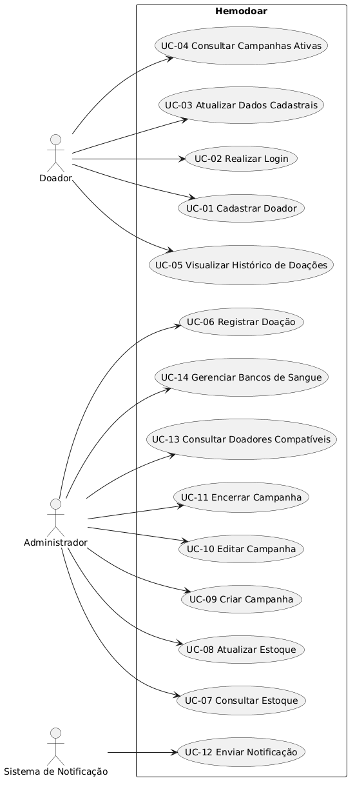](./Diagramas/CasoDeUso.png)

🔗 **Código PlantUML:** [`CasoDeUso.txt`](./Codigos%20PlantUML/CasoDeUso.txt)

---

### Diagrama de Classes

[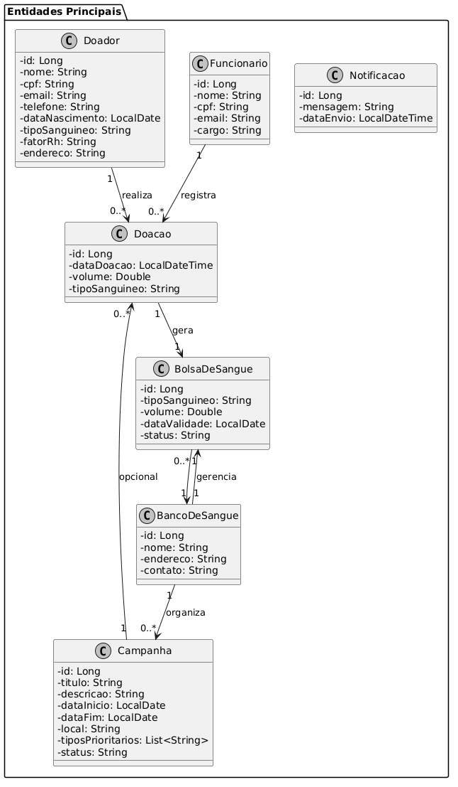](./Diagramas/Classes.png)

🔗 **Código PlantUML:** [`Classes.txt`](./Codigos%20PlantUML/Classes.txt)

---

### Diagrama de Comunicação — UC-01

[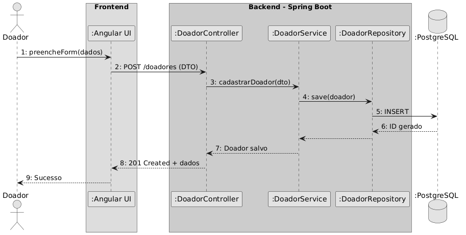](./Diagramas/ComunicacaoUC-01.png)

🔗 **Código PlantUML:** [`ComunicacaoUC-01.txt`](./Codigos%20PlantUML/ComunicacaoUC-01.txt)

---

### Diagrama de Comunicação — UC-06

[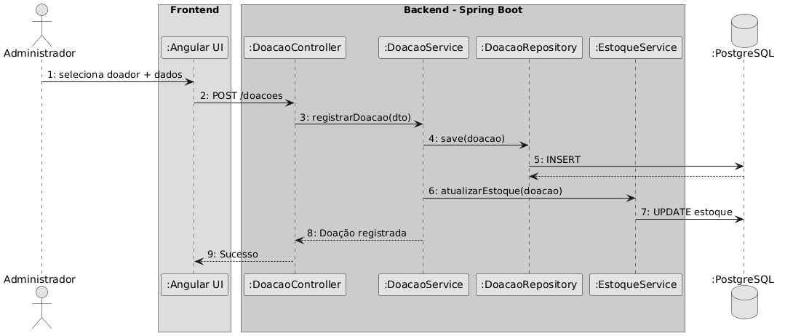](./Diagramas/ComunicacaoUC-06.png)

🔗 **Código PlantUML:** [`ComunicacaoUC-06.txt`](./Codigos%20PlantUML/ComunicacaoUC-06.txt)

---

### Diagrama de Comunicação — UC-09

[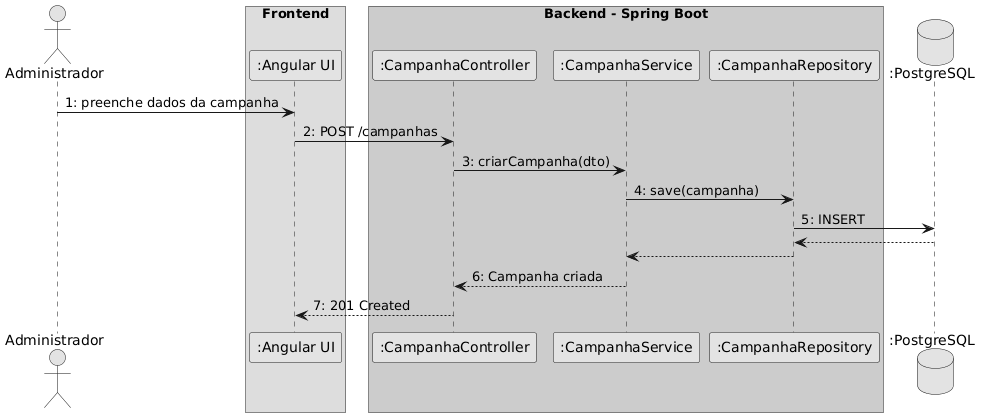](./Diagramas/ComunicacaoUC-09.png)

🔗 **Código PlantUML:** [`ComunicacaoUC-09.txt`](./Codigos%20PlantUML/ComunicacaoUC-09.txt)

---

### Diagrama Entidade-Relacionamento (ER)

[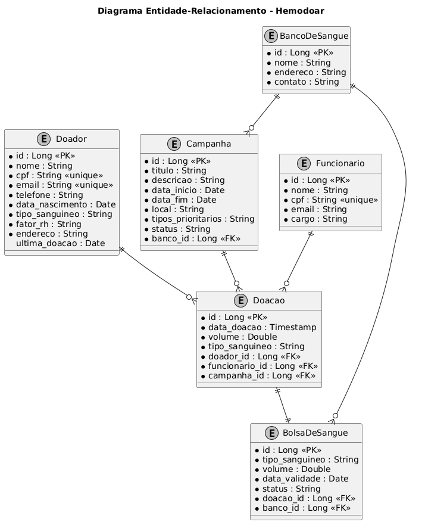](./Diagramas/ER.png)

🔗 **Código PlantUML:** [`ER.txt`](./Codigos%20PlantUML/ER.txt)

---

### Diagrama de Estados — Doação

[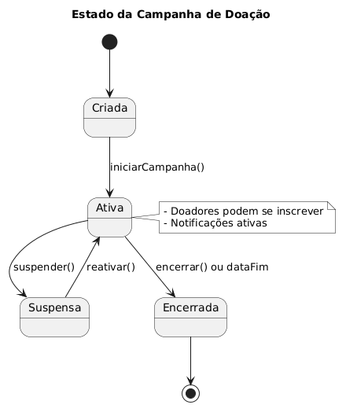](./Diagramas/EstadosDoacao.png)

🔗 **Código PlantUML:** [`EstadosDoacao.txt`](./Codigos%20PlantUML/EstadosDoacao.txt)

---

### Diagrama de Estados — Sangue

[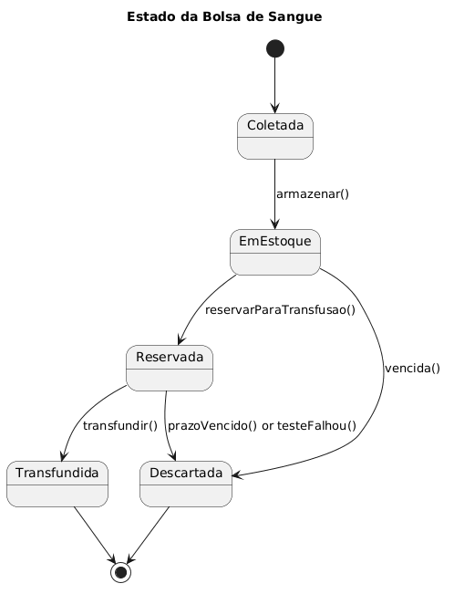](./Diagramas/EstadosSangue.png)

🔗 **Código PlantUML:** [`EstadosSangue.txt`](./Codigos%20PlantUML/EstadosSangue.txt)

---

### Diagramas de Implantação e Componentes

🔗 **Código PlantUML:** [`Implantacao e Componentes.txt`](./Codigos%20PlantUML/Implantacao%20e%20Componentes.txt)

---

### Diagrama de Sequência — UC-01

[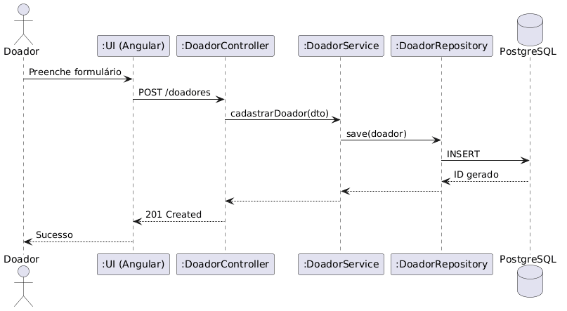](./Diagramas/SequenciaUC-01.png)

🔗 **Código PlantUML:** [`SequenciaUC-01.txt`](./Codigos%20PlantUML/SequenciaUC-01.txt)

---

### Diagrama de Sequência — UC-07

[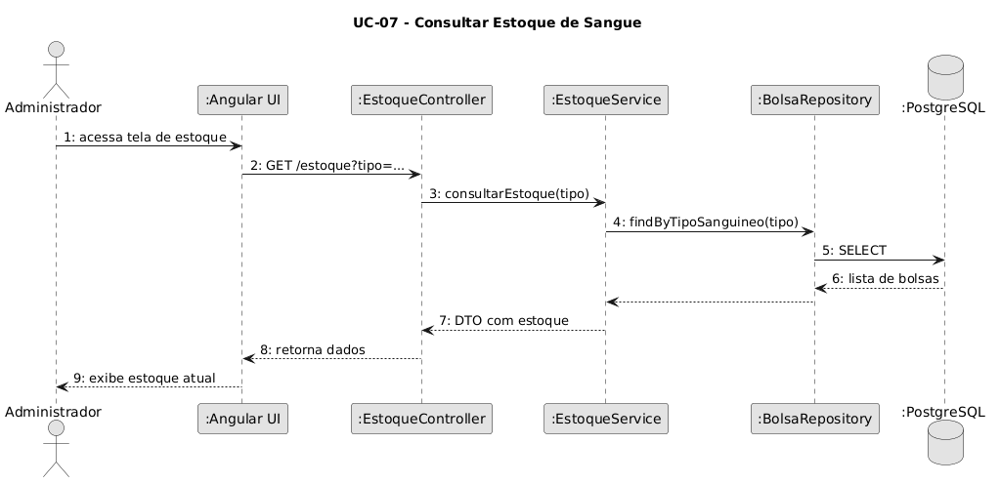](./Diagramas/SequenciaUC-07.png)

🔗 **Código PlantUML:** [`SequenciaUC-07.txt`](./Codigos%20PlantUML/SequenciaUC-07.txt)

---

### Diagrama de Sequência — UC-12

[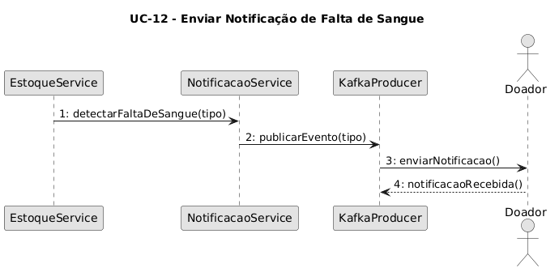](./Diagramas/SequenciaUC-12.png)

🔗 **Código PlantUML:** [`SequenciaUC-12.txt`](./Codigos%20PlantUML/SequenciaUC-12.txt)

---

> 📌 Todos os diagramas foram modelados em PlantUML e seus códigos-fonte estão versionados no repositório.
---

## 📄 Licença

Este projeto é distribuído sob a **[Licença MIT](LICENSE)**.

---

*Projeto desenvolvido para a disciplina de Laboratório de Desenvolvimento de Software — PUC Minas, 2025.*
